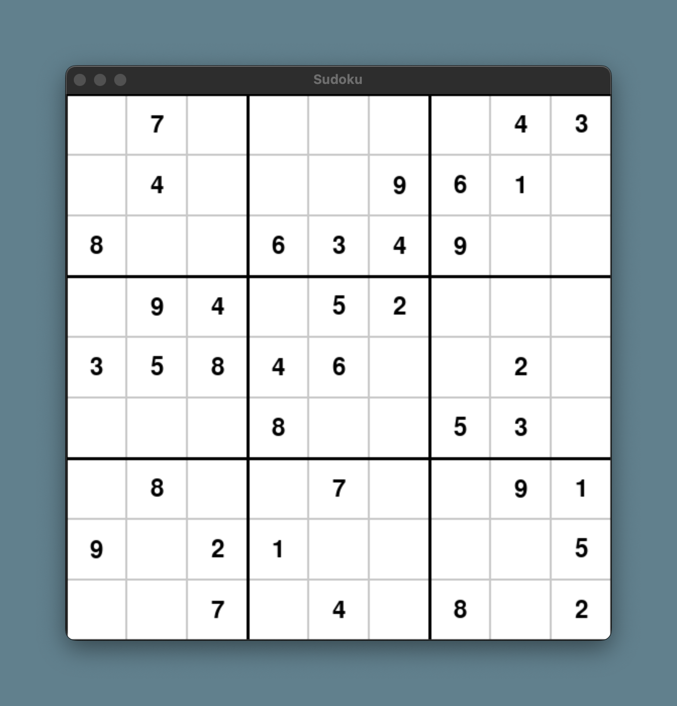

# CS131 A4 Sudoku Solver - WIP
#### Bix von Goeler

_A Project for the Class CS131 Artificial Intellegence at Tufts University_

This project implements a Sudoku solver by turning the puzzle into a constraint satisfaction problem (CSP).
The project includes a GUI for visualizing the solving process.

## Requirements
- Tested using `Python 3.11`
- Install: `pygame` for GUI and visualization
- Install: `numpy` for numerical operations and sudoku grid representation
- Or run: `pip install -r requirements.txt` inside project directory

## Running The Project
1. Run the project using `python main.py`
2. The GUI will open, displaying the grid and the current puzzle.

3. Use the following keys to control the simulation:
   - `spacebar`: Start/stop the solver
   - `rightarrow`: Step forward in search
   - `r`: Reset the current puzzle
   - `n`: New random puzzle
4. When finished exit the program by closing the window or with `^C` in the terminal.

## Structure and Assumptions
