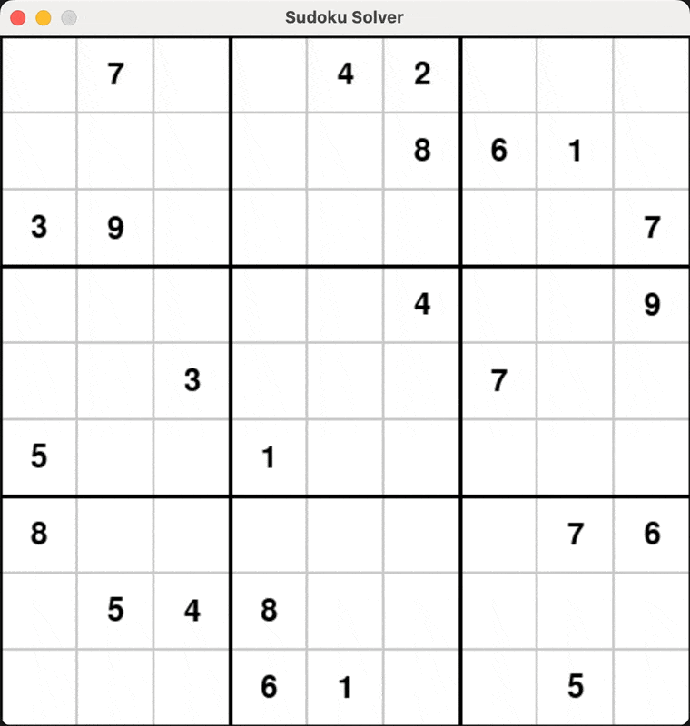

# CS131 A4 Sudoku Solver
#### Bix von Goeler

This project implements a Sudoku solver by turning the puzzle into a constraint satisfaction problem (CSP).
The project includes a GUI for visualizing the solving process.

## Requirements
- Tested using `Python 3.11`
- Install: `pygame` for GUI and visualization
- Install: `numpy` for numerical operations and sudoku grid representation
- Or run: `pip install -r requirements.txt` inside project directory

## Running The Project
1. Run the project using `python main.py` and optionally the following args:
   - `-s SPEED`: Millisecond Delay Between Solve Steps (default 15)
   - `-p PUZZLE`: Puzzle to solve: [easy | evil | rand] (default evil)
   - `-h`| `--help`: Show and explain these options again
2. The GUI will open, displaying the grid and the current puzzle.

3. Use the following keys to control the simulation:
   - `spacebar`: Start the solver
4. When finished exit the program by closing the window or with `^C` in the terminal.

## Structure and Assumptions
This implementation uses several constraint satisfaction principles:

### Domain Initialization: 
Each empty cell starts with a domain of possible values (1-9) that don't conflict with existing numbers.

### Variable Selection Heuristics:
Minimum Remaining Values (MRV): Selects cells with the fewest possible values first.
Degree Heuristic: When there's a tie, selects the cell that constrains the most other cells.

### Forward Checking: 
After each assignment, we update the domains of related cells and check for cells with empty domains.
Backtracking: If an assignment leads to a dead end, it undoes the assignment and tries the next value.

### Random Dataset:
The rand puzzle option chooses a random puzzle from a large dataset of puzzles.
The easy and evil options complete the puzzles required by assignment spec.

## Real-time Visualization:
The solver works step-by-step, integrated into the game loop.
The current cell being considered is highlighted in yellow.
Filled-in values are shown in blue to distinguish from the original puzzle.